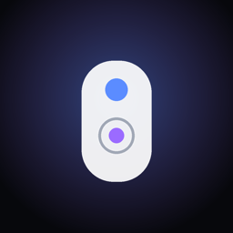
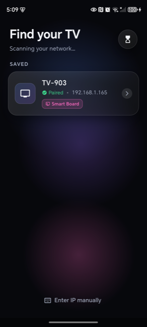
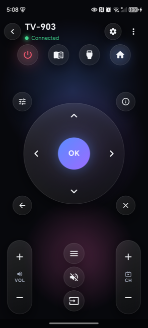
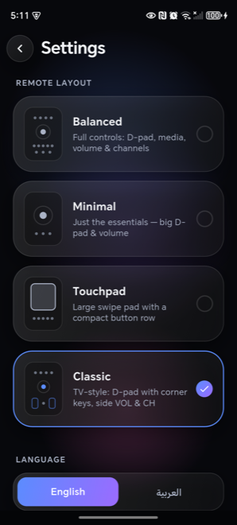

<p align="center">
  
</p>

<h1 align="center">Universal Remote</h1>

<p align="center">
  A phone-based universal remote built with Flutter. Discover, pair, and control
  TVs and streaming devices on your local network — Android TV / Google TV, CVTE smart
  boards, Roku, Samsung, and LG — plus infrared control for TVs, air conditioners, and
  a range of home appliances over the phone's IR blaster, a Wi-Fi IR hub, or Wi-Fi.
</p>

<p align="center">
  <a href="https://flutter.dev"></a>
  <a href="https://dart.dev"></a>
  
  <a href="LICENSE"></a>
  <a href="https://pub.dev/packages/flutter_lints"></a>
  
</p>

---

## Overview

Universal Remote replaces the physical remotes for the screens — and appliances —
around you. It speaks each vendor's native control protocol directly over the local
network, so there is no cloud account, no companion hub, and no extra hardware: your
phone and the device on the same Wi-Fi is all that is required. Where a network
protocol is unavailable, the app falls back to infrared — through the phone's own IR
emitter, a Wi-Fi IR hub, or a smart Wi-Fi appliance.

## Features

- Automatic discovery of devices on the local network (mDNS and SSDP).
- Pairing flows for each protocol, including on-screen code and approval prompts.
- Full directional pad, media transport, volume, and channel controls.
- Touchpad and air-mouse modes, with gyroscope pointer control and adjustable sensitivity.
- On-screen keyboard and number pad for text entry and direct channel input.
- Push-to-talk voice search on protocols that support it.
- Roku app launcher: browse and open the apps installed on the connected device.
- **Appliance control** — air conditioners, fans, lights, TVs, radios, DVD/Blu-ray
  players, set-top boxes, projectors, soundbars, and heaters, over the phone's IR
  emitter, a Wi-Fi IR hub, or Wi-Fi, with a tailored panel per device kind.
- **Real, per-brand IR protocols** for 40+ brands — not just generic codes.
- Manual connection by IP address with brand selection when discovery is unavailable.
- Multiple remote layouts: balanced, minimal, touchpad, and classic.
- English and Arabic interface with full right-to-left support.

## Screenshots

<p align="center">
  
  &nbsp;&nbsp;
  
  &nbsp;&nbsp;
  
</p>

## Supported devices

| Brand / platform        | Protocol                  | Transport                    | Pairing             |
|-------------------------|---------------------------|------------------------------|---------------------|
| Android TV / Google TV  | Android TV Remote v2      | TLS + protobuf (port 6466)   | On-screen code      |
| CVTE / Bytello boards   | Bytello control           | WebSocket (port 8125)        | PIN                 |
| Roku                    | External Control Protocol | HTTP (port 8060)             | None required       |
| Samsung (Tizen)         | Samsung remote control v2 | Secure WebSocket (port 8002) | On-screen approval  |
| LG (webOS)              | SSAP                      | WebSocket (port 3000)        | On-screen approval  |
| Any TV with IR          | NEC infrared              | Device IR emitter            | None required       |

## Appliance control

Beyond network-connected TVs, the app controls infrared and Wi-Fi appliances. Each
appliance is one of several kinds, each with a tailored control panel (plus a generic
power panel for anything else):

| Kind             | Panel                                              |
|------------------|----------------------------------------------------|
| Air conditioner  | Thermostat dial, mode, fan speed, swing            |
| Fan              | Power, speed steps, oscillation                    |
| Light            | Power, brightness slider                           |
| Heater           | Power, heat level, oscillation                     |
| TV               | Power, volume/channel, D-pad, numeric keypad       |
| Radio / Hi-Fi    | Volume, presets, tuning, source, transport         |
| DVD / Blu-ray    | Transport, D-pad, menu, numeric keypad, eject      |
| Set-top box      | Channel/volume, D-pad, numeric keypad              |
| Projector        | Source, menu, D-pad, focus                         |
| Soundbar         | Volume, source, bass, transport                    |

Commands reach an appliance over one of three transports: the **phone's own IR
emitter**, a **Wi-Fi IR hub** (Broadlink / Tuya style, auto-discovered on the network),
or a **smart Wi-Fi appliance** speaking its own API. State-based kinds (AC, fan, light,
heater) remember their last setting; key-based kinds send momentary remote keys.

### Real IR protocols

Rather than a single generic code set, infrared commands use the real, documented
protocol for each brand, with the correct carrier frequency and frame layout:

- **TVs / AV** — Samsung32, LG (NEC), Sony SIRC (40 kHz), Panasonic Kaseikyo (37 kHz),
  Philips RC5/RC6 (36 kHz), Sharp, and extended-NEC for Hisense and TCL.
- **Air conditioners** — full stateful frames (every press carries the complete
  power / temperature / mode / fan state with the brand's checksum) for Coolix
  (Beko / OEM), Midea, Daikin, Panasonic, Toshiba, Hitachi, LG, Samsung, Haier,
  Kelon (Hisense), TCL, Electra (Electrolux / Frigidaire), Whirlpool, and Sharp.

The catalog covers 40+ brands across premium (Miele, Bosch, Siemens, Liebherr, Sub-Zero,
Wolf, Thermador, Viking, Smeg), value (Haier, Midea, Beko, Hisense, TCL, Candy), and
Middle-East-popular (LG, Samsung, Panasonic, Sharp, Hitachi, Toshiba) tiers. Brands whose
devices have no IR remote — large kitchen and laundry appliances — are offered over Wi-Fi
only. IR codes follow each protocol's published specification; per-model accuracy is not
guaranteed for every variant, and a brand can be promoted to device-verified codes by
adding a dedicated encoder.

## Architecture

Each vendor protocol is implemented behind a single `RemoteBackend` interface, so the
interface layer is decoupled from the wire format. A central controller owns the active
backend, exposes a uniform set of commands, and notifies the UI of connection state.

```
lib/
  atv/                   Network control backends and pairing
    backend.dart           RemoteBackend interface and protocol enum
    atv_controller.dart    App state, backend lifecycle, command routing
    discovery.dart         mDNS and SSDP device discovery
    pairing_secret.dart    Android TV pairing handshake and secret derivation
    googletv_backend.dart
    cvte_backend.dart
    roku_backend.dart
    samsung_backend.dart
    lg_backend.dart
    ir_backend.dart        Native infrared via platform channel
    air_mouse.dart         Gyroscope-to-pointer conversion
  appliances/            IR / Wi-Fi appliance control
    appliance.dart         Appliance model + per-kind state (AC, fan, light, heater)
    appliance_controller.dart  Saved appliances, control routing per transport
    appliance_transport.dart   Built-in IR, Wi-Fi IR hub, and Wi-Fi delivery
    brand_catalog.dart     Brand → kind → encoder/transport mapping (40+ brands)
    ir_protocols.dart      TV/AV frame builders (NEC, Samsung, SIRC, RC5/6, …)
    device_ir_encoder.dart Per-brand key-based encoders (TV, DVD, radio, …)
    ac_ir_encoder.dart     AC encoder interface + registry
    ac_protocols.dart      Shared stateful-AC frame + checksum helpers
    ac_brand_encoders.dart 14 real per-brand AC encoders
  proto/                 Hand-written protobuf wire codec (no codegen)
  i18n/                  English and Arabic strings, RTL handling
  ui/                    Screens, layouts, and reusable widgets
```

Key design points:

- The interface is built with Provider for state management and a custom glass-style
  component set.
- The Android TV handshake generates a 2048-bit RSA client certificate on a background
  isolate and derives the pairing secret from both certificates and the on-screen code.
- The protobuf wire format is hand-written with varint framing, so there is no protoc
  or code-generation dependency.
- IR encoders are layered: low-level protocol frame builders (carrier, leader, bit
  timings) underneath per-brand command tables, with a brand catalog resolving each
  appliance to its real encoder and falling back to a generic one when none applies.
- Discovery, pairing, and command handling are fully asynchronous and fail soft — a
  dropped packet or an unreachable device never crashes the session.

## Getting started

### Prerequisites

- Flutter 3.41 or newer
- Dart 3.11 or newer
- Android SDK, and Xcode for iOS builds

### Install and run

```bash
flutter pub get
flutter run
```

### Build a release APK

```bash
flutter build apk --release --split-per-abi
```

Split builds produce per-architecture APKs in `build/app/outputs/flutter-apk/`.

## Testing

The network protocol encoders, key mappings, pairing logic, certificate generation,
and the IR protocol frame builders and appliance encoders (verified against known
reference codes and checksums) are covered by unit tests:

```bash
flutter test
```

Static analysis uses the `flutter_lints` rule set:

```bash
flutter analyze
```

## Permissions

The app requests only what each feature needs:

- Local network access for discovery and control.
- Microphone access for voice search, requested only when the feature is used.
- `TRANSMIT_IR` for infrared control on devices with an IR emitter.

No data leaves the device; all control traffic stays on the local network.

## Security and privacy

- Per-TV credentials — Google TV client certificates, and the Samsung token and
  LG client-key — are stored in the OS keystore (Android Keystore / iOS Keychain)
  via `flutter_secure_storage`, never in plaintext preferences.
- Only non-sensitive metadata (name, address, protocol) is kept in shared
  preferences; secrets live in secure storage keyed by a stable device id.
- A paired TV is remembered by a stable device identity (SSDP UUID, mDNS service
  name, or serial), so it is still recognised after its IP address changes on the
  network — no need to pair again.
- All control traffic is local; the app has no backend and collects no telemetry.

## Project information

- Package name: `com.molood.atv_remote`
- Minimum Flutter SDK: 3.41

## License

Released under the MIT License. See [LICENSE](LICENSE) for details.
